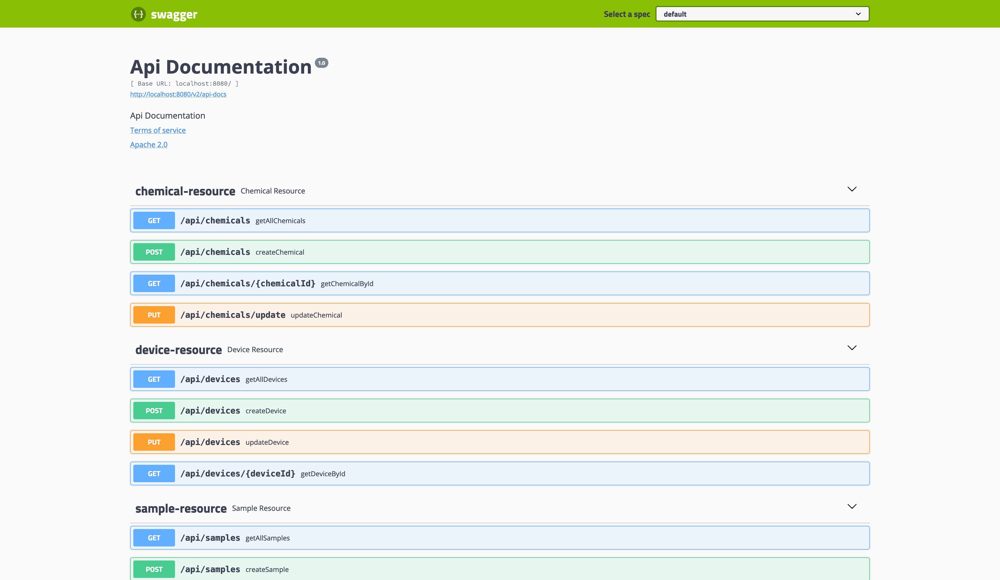
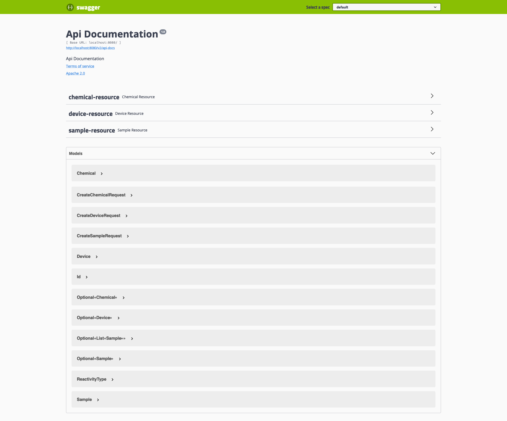

# LAB-INVENTORY

A domain Driven approach has been taken and for each of the implemented category tables.

### Project Structure

For each category the code files are arranged in the following packages

- api
- models
- service
- store

The above decision is to ensure that a single category san be worked on without worrying of the other domain parts

There are 3 laboratory categories with attributes supported in the laboratory inventory service as described below.

## Samples Category

- sampleName
- disease
- strainOrBreed
- genotype

## Devices Category

- element
- massInKg
- lengthInMeters
- diameterInMeters
- remarks

## Chemicals Category

- chemicalName
- flammability
- toxicity
- acidity
- reactivity

For each of the categories above there is a corresponding resource endpoint to create, update and list respectively 

The project is implemented with Springboot version 2. 

The project requires at least Java 11 and above

The dependencies wrapper is maven

### Unit and Integration tests

There is a set of unit and integration tests. To run the tests use the command below. 
<code>mvn test </code>

### Compiling and Building

There are various ways to run the project namely as a <em> self-contained executable .jar </em> or using the <em> maven
spring boot plugin support</em>.

#### Using the self-contained executable

To use this option use the following command in sequence from the project root.

To compile with tests use :  <code>mvn clean package</code> 

To compile without tests use :  <code>mvn clean package -DskipTests=true </code>

After executing either of the above commands use the below command to run the service . <code>java -jar target/lab-experiment-inventory-0.0.1-SNAPSHOT.jar
</code>

#### Using the springboot maven plugin

This option is the most straight forward as it only requires the command below on the project root:

<code>mvn spring-boot:run</code>

## Interacting with the various endpoints

 There is a REST documentation tool already provided with the code base to be found on the project base URL on the following path <code>/swagger-ui.html</code>. 
 
 The interface should look something like the attached images 

An image showing collapse api contracts

Assuming the service is running on <code>localhost:8080</code>  the link below should lead to the api documentation 
 [Swagger UI endpoint](http://localhost:8080/swagger-ui.html)

## Expected enhancements

- Serialize all the Api errors for proper presentation to the front-end
- Add docker support for easy shipping
- Add a docker-compose file for both the service and database layer
- Optimise persistence layer for quicker queries
- Optimise the test cases for short execution times
- Enhance Api documentation beyond the default auto generated description